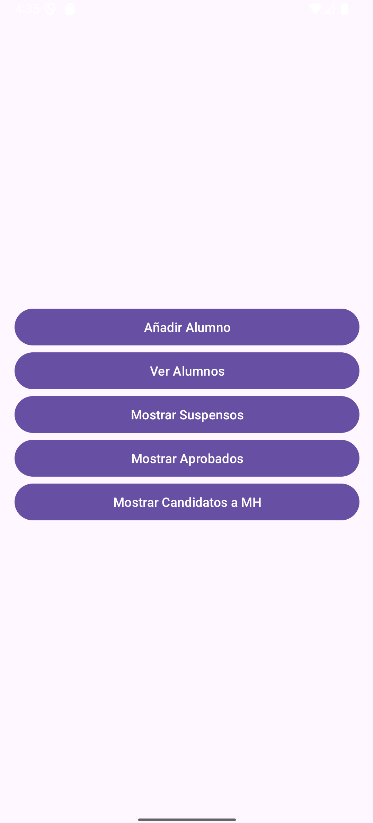
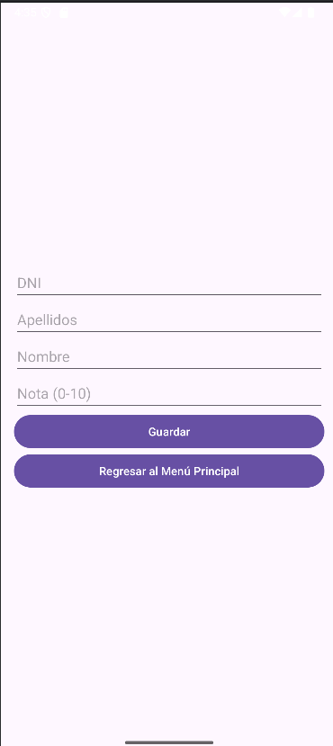
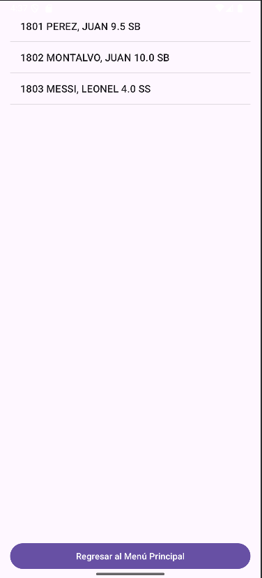
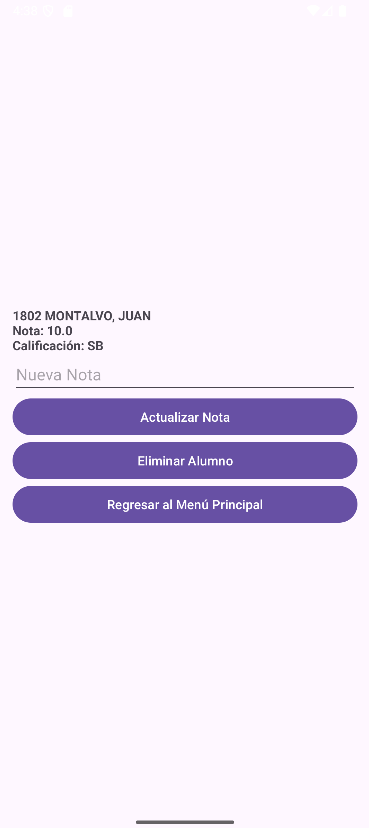

# Gestión de Calificaciones de Alumnos

Un programa desarrollado para gestionar las calificaciones de un grupo de alumnos, facilitando la administración de sus notas y calificaciones.

## Funcionalidades principales
El programa permite realizar diversas operaciones sobre la información de los alumnos:

1. **Mostrar alumnos:** Lista toda la información de los alumnos en el formato:

2. **Introducir alumno:** Permite registrar un nuevo alumno solicitando:
- **DNI:** Debe ser único.
- **Apellidos y nombre:** Información básica del alumno.
- **Nota:** Calificación numérica asignada.
- **Calificación:** Se calcula automáticamente:
  - `SS` (Suspenso): Nota < 5
  - `AP` (Aprobado): 5 ≤ Nota < 7
  - `NT` (Notable): 7 ≤ Nota < 9
  - `SB` (Sobresaliente): Nota ≥ 9

3. **Eliminar alumno:** Elimina un alumno según su DNI.

4. **Consultar nota y calificación:** Muestra la nota y calificación de un alumno a partir de su DNI.

5. **Modificar nota:** Actualiza la nota de un alumno, recalculando automáticamente su calificación.

6. **Mostrar alumnos suspensos:** Lista alumnos con nota menor a 5.

7. **Mostrar alumnos aprobados:** Lista alumnos con nota igual o mayor a 5.

8. **Candidatos a Matrícula de Honor:** Lista alumnos con nota igual a 10.

9. **Modificar calificación:** Permite ajustar manualmente la calificación calculada automáticamente.

## Capturas de pantalla

## Instalación
Puedes descargar el programa desde el siguiente enlace:
[Descargar Programa](https://drive.google.com/file/d/1O4rTtIthUbmKbNLq1WrII1Lh3_5dwxPq/view?usp=sharing)

### Detalles Adicionales:
1. **Introducción de alumnos:**
- DNI debe ser único para evitar duplicados.
- Las notas deben ser valores numéricos válidos.

2. **Eliminación de alumnos:**
- El programa verifica la existencia del DNI antes de eliminar.

3. **Cálculo de calificación:**
- Basado en reglas predefinidas según la nota asignada.

4. **Validaciones robustas:**
- Previene errores como DNIs duplicados, campos vacíos o valores inválidos para las notas.

## Contacto
Si tienes dudas o sugerencias, no dudes en contactarme en [barreraha@itecsur.edu.ec](mailto:barreraha@itecsur.edu.ec) o abrir un issue en este repositorio.
